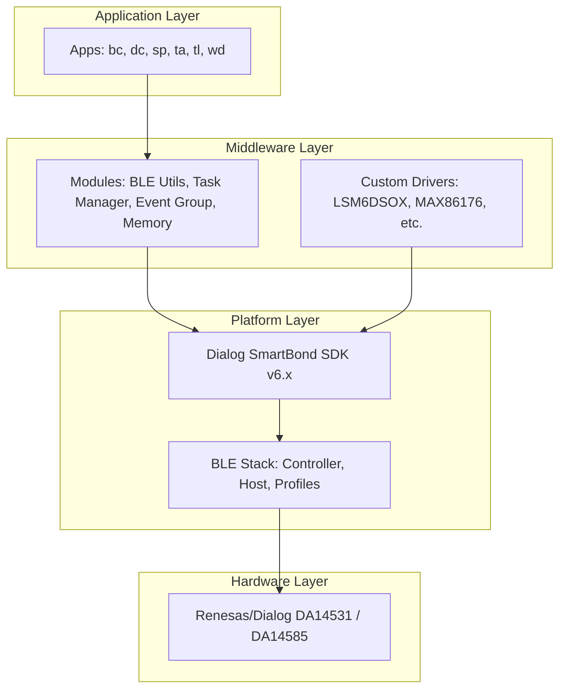
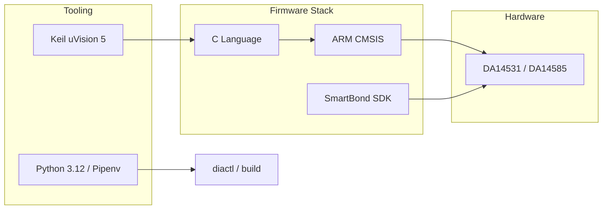

# Field Devices - Overview

## Executive Summary
This repository is a monorepo for Renesas/Dialog Bluetooth Low Energy (BLE) firmware applications based on the DA14531 and DA14585 SoCs. It provides a structured development environment with custom middleware (modules) and a dedicated CLI tool (`diactl`) to manage and generate field device applications such as wearables and smart sensors.

## Tech Stack
- **Languages**: C (Firmware), Python 3.12 (Tools), Assembly (Startup files).
- **Frameworks/SDKs**: Renesas/Dialog SmartBond™ SDK (v6.x), ARM CMSIS.
- **Hardware**: Renesas/Dialog DA14531, DA14535, DA14585 (ARM Cortex-M0/M0+).
- **Development Tools**: Keil uVision 5 (IDE/Compiler), Pipenv (Python environment), `click`, `cookiecutter`.

## Project Type
**monorepo | firmware | IoT**

## Architecture Overview
The project follows a layered architecture designed to decouple application logic from the underlying hardware-specific SDK.

- **Application Layer**: Located in `apps/`, containing specific device logic.
- **Middleware Layer**: Located in `modules/`, providing abstractions for BLE, task management, and event handling.
- **Platform/SDK Layer**: Located in `sdk/`, consisting of the vendor-provided BLE stack and peripheral drivers.
- **Hardware Layer**: The physical DA14xxx SoCs.

### Architecture Diagram

### Tech Stack Diagram

## Main Modules
- **`apps/`**: Contains multiple firmware applications (e.g., `wd` for wearables, `sp` for smartbands).
- **`modules/`**: Core middleware. `user_task_manager` implements a state-machine based task execution engine.
- **`sdk/`**: The Renesas/Dialog SmartBond SDK core.
- **`include/`**: System-wide configuration headers for different SoC variants.
- **`tools/diactl/`**: A Python CLI tool used to bootstrap new applications and manage the project.
- **`drivers/`**: Target-specific peripheral drivers for sensors and PMICs.

## Key Features
- **Multi-App Support**: Centralized management of different firmware targets.
- **Advanced BLE Integration**: Pre-configured profiles (Battery, Device Info) and custom services.
- **State-Machine Task Manager**: A custom `user_task_manager` that simplifies complex asynchronous BLE flows.
- **Sensor Ecosystem**: Integrated drivers for LSM6DSOX (IMU), MAX86176 (PPG), and NPM1300 (PMIC).
- **Scaffolding Tool**: `diactl` enables rapid generation of new projects following the established architecture.

## Code Patterns
- **Naming Conventions**: Extensive use of `user_` prefix for application-level code to distinguish from SDK code.
- **Task/Event Pattern**: Application logic is organized into tasks with handlers (`task_handler`) that process events.
- **Config-Driven Development**: Hardware and software features are toggled via header macros (`user_config.h`).
- **Memory Management**: Custom memory helpers (`user_memory.c`) for safe allocation in constrained environments.

## Dependencies
- [[field-devices__foundation__sdk-analysis|uses]]
- [[field-devices__middleware__task-manager|uses]]
- [[field-devices__app__wearable-device|uses]]
- [[field-devices__middleware__ble-utils|uses]]

## Recommendations
1. **Task Manager Analysis**: Focus on `modules/src/tasks/user_task_manager.c` to understand how the system handles concurrent operations.
2. **Application Reference**: Use [[field-devices__app__wearable-device|Wearable Device]] as the reference implementation for complex sensor integration.
3. **BLE Implementation**: Examine `modules/src/ble/user_das.c` to see how the project abstracts the standard BLE profile interactions.
