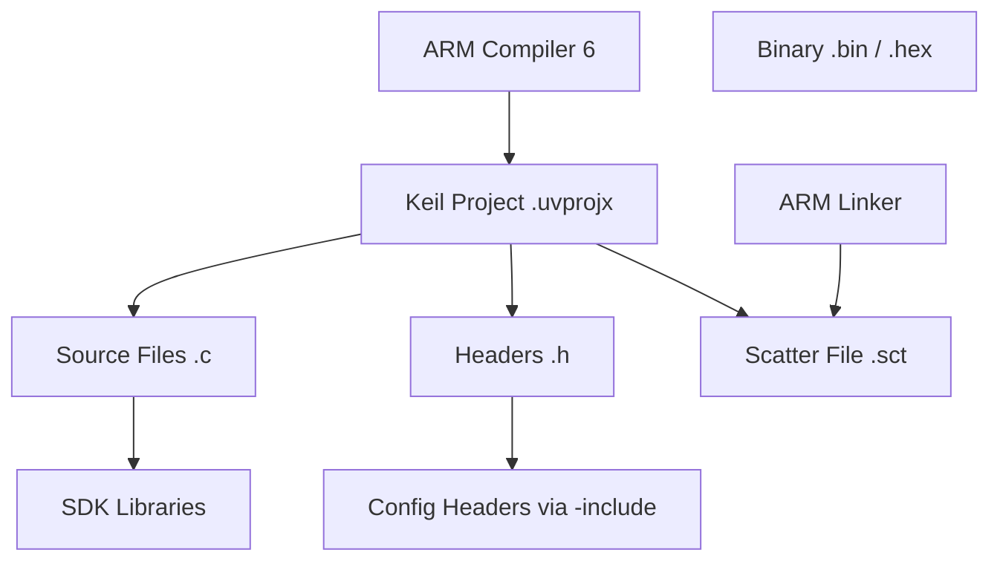

# Build System

## Analysis
The build system relies on Keil uVision 5 and the ARM Compiler 6 (armclang). This is a standard professional choice for ARM-based microcontrollers.

### Keil Project Configuration
- **Project Files**: Found in `apps/{app_name}/envs/Keil_5/`.
- **Compiler**: ARM Compiler 6.
- **Global Includes**: The build uses `-include` flags in the project file to force include essential configuration headers:
    - `da1458x_config_basic.h`
    - `da1458x_config_advanced.h`
    - `user_config.h`
- **Memory Management**: Scatter files (`.sct`) are used to define the memory layout (RAM/ROM) for the specific SoC variants (DA14531, DA14585).

### Build Orchestration
While Keil manages the actual compilation, the `diactl` tool ([[field-devices__foundation__diactl-tool|Diactl Tool]]) manages the creation and high-level orchestration of these projects.

### Diagrams
## Build Dependency Tree

## Findings
- Standard Keil-based workflow facilitates debugging and development.
- Use of `-include` flags ensures that configuration is consistent across all source files without explicit includes.
- Scatter files are optimized for the tight memory constraints of the DA145xx family (e.g., SysRAM usage).

## Dependencies
- [[field-devices__foundation__diactl-tool|uses]]

## Next Steps
Analyze the [[field-devices__foundation__diactl-tool|Diactl Tool]] to understand how it automates the creation of these build environments.
