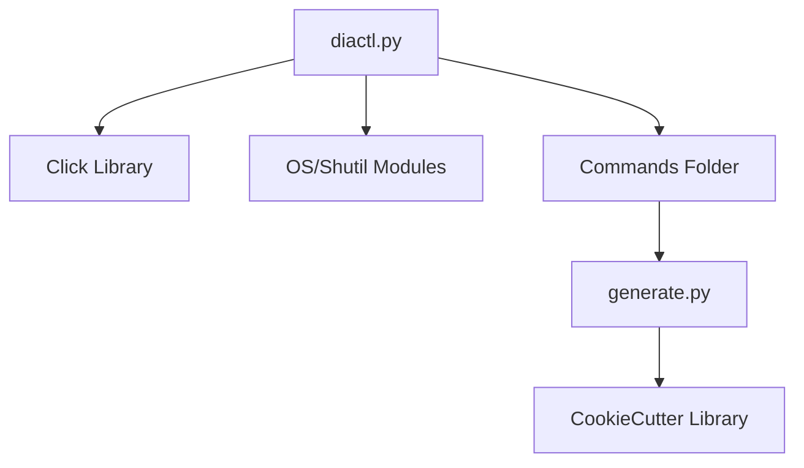

# Diactl Tool

## Analysis
`diactl` is a custom Python-based Command Line Interface (CLI) tool designed to manage the monorepo and automate repetitive tasks.

### Technology Stack
- **Language**: Python 3.
- **CLI Framework**: `click` (used for command definitions and nested groups).
- **Template Engine**: `cookiecutter` (used for project scaffolding).

### Command Structure
The tool uses a dynamic command loading mechanism. Commands are defined in the `commands/` directory and loaded at runtime.
- **`generate app`**: Uses `cookiecutter` and templates in `templates/app/` to create a new application structure in the `apps/` directory. It requires parameters like `--name`, `--long-name`, and `--version`.

### Code Generation Workflow
1. Developer runs `diactl generate app ...`.
2. Tool reads the template from `templates/app/`.
3. `cookiecutter` replaces placeholders with provided context.
4. A new application directory is created with standardized source and project files.

### Diagrams
## Python Dependencies

## Findings
- High level of automation for boilerplate code.
- Ensures consistency across all device firmware by using a shared template.
- The dynamic plugin architecture allows for easy expansion with new commands.

## Dependencies
- [[field-devices__middleware__task-manager|uses]]
- [[field-devices__middleware__ble-utils|uses]]
- [[field-devices__middleware__memory-helpers|uses]]

## Next Steps
Proceed to Layer 2 to analyze shared business logic components: [[field-devices__middleware__task-manager|Task Manager]], [[field-devices__middleware__ble-utils|BLE Utils]], and [[field-devices__middleware__memory-helpers|Memory Helpers]].
