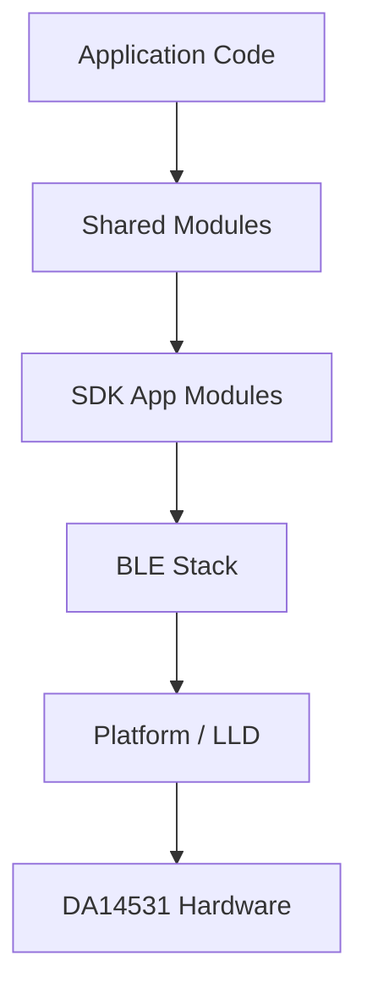

# SDK Analysis

## Analysis
The repository integrates the Dialog Semiconductor (now Renesas) SmartBond™ SDK for the DA14531/DA1458x family of SoCs.

### SDK Details
- **Version**: 6.22.1401 (confirmed by `sdk/version.txt`).
- **Target Architecture**: ARM Cortex-M0+.
- **Components**:
    - `sdk/core/platform/`: Low-level drivers (LLD), boot sequence, and CMSIS files.
    - `sdk/core/ble_stack/`: The proprietary Bluetooth Low Energy stack implementation.
    - `sdk/core/app_modules/`: SDK-provided application-level modules (e.g., battery service, device information service).
    - `sdk/third_party/`: External libraries like `micro_ecc`, `crc32`, and random number generators.

### Integration Points
- **Startup**: Files in `sdk/core/platform/arch/boot/` handle the reset vector and system initialization before jumping to `main`.
- **Configuration**: Managed via `da1458x_config_*.h` files, which are often included globally via compiler flags.

### Diagrams
## Architecture Overview

## Tech Stack Layers

## Findings
- The SDK is integrated as a local copy in the `sdk/` directory, ensuring build reproducibility.
- Heavy reliance on Dialog's proprietary architectural patterns (e.g., asynchronous task messaging).
- Well-organized separation between core SDK components and third-party utilities.

## Dependencies
- [[field-devices__foundation__build-system|depends_on]]

## Next Steps
Analyze the build system ([[field-devices__foundation__build-system|Build System]]) to see how these SDK components are compiled and linked.
