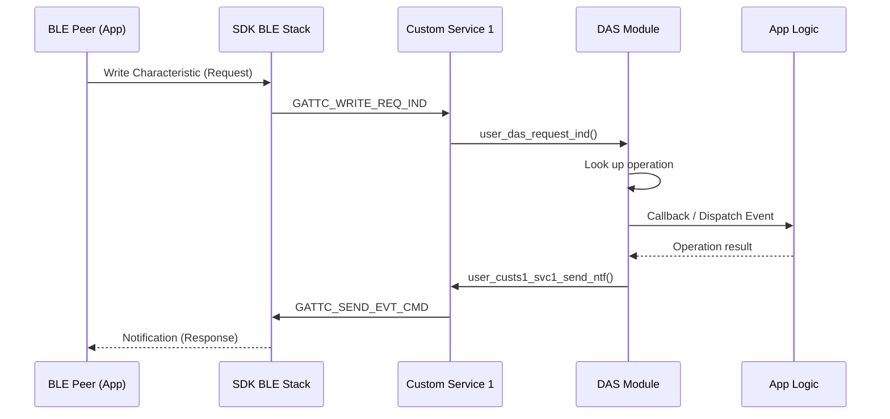

# BLE Utils

## Analysis
The BLE abstraction layer facilitates high-level communication by wrapping the Dialog SDK's low-level BLE stack. The primary implementation is the Data Acquisition Service (DAS).

### Data Acquisition Service (DAS)
- **Purpose**: Provides a robust protocol for bi-directional data transfer between the field device and a mobile app or gateway.
- **Fragmentation**: Large data blocks are split into chunks (`user_das_transmit_dp_chunk`). The chunk size is negotiated based on the MTU (`user_ble_env[conidx].packet_size`).
- **Operation Handlers**: DAS uses a table of operations (`user_das_operations_definition`) to map command codes to specific C handlers.
- **State Integration**: Like the Task Manager, DAS stores its transfer environment in retention memory, allowing large transfers to continue across connection intervals and sleep modes.

### Authentication Logic
The service includes an authentication mechanism (`user_das_auth_req_handler`) that uses a challenge-response pattern or a specific evaluation function (`user_run_eval_func`) to verify the peer.

### Diagrams
## BLE Request Lifecycle

## Findings
- **Robust Protocol**: The chunking mechanism ensures that memory constraints do not limit the size of transferable data.
- **Modular Design**: Adding new BLE commands only requires adding an entry to the operation table.
- **Security**: The presence of an `auth` flag in `user_ble_env` suggests a multi-level access control system.

## Dependencies
- [[field-devices__driver__peripheral-drivers|uses]]

## Next Steps
Investigate the peripheral drivers (Layer 3, [[field-devices__driver__peripheral-drivers|Peripheral Drivers]]) which provide the data that DAS eventually transmits.
