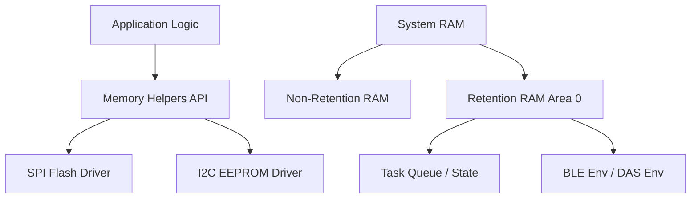

# Memory Helpers

## Analysis
Memory management in the `field-devices` firmware is focused on non-volatile storage abstraction and efficient RAM usage (retention memory).

### Non-Volatile Memory Abstraction
The `user_memory.c` module provides a hardware-agnostic API for accessing external storage.
- **Supported Types**: SPI Flash and I2C EEPROM.
- **Abstraction Layer**: Functions like `user_memory_read`, `user_memory_write`, and `user_memory_erase` hide the complexity of the underlying peripheral (SPI or I2C) and the specific memory chips.
- **Configurability**: Selection is made at compile-time via `USER_MEMORY_TYPE` and `CFG_SPI_FLASH_ENABLE` / `CFG_I2C_EEPROM_ENABLE` defines.

### Retention Memory
While not explicitly in `user_memory.c`, the codebase makes extensive use of retention RAM sections:
- `__SECTION_ZERO("retention_mem_area0")`: Used for variables that must survive deep sleep (Extended/Deep Sleep modes of the DA145xx).
- This is critical for maintaining task states, BLE connection parameters, and application-specific metadata.

### Diagrams
## Memory Hierarchy

## Findings
- **Hardware Flexibility**: The abstraction allows the same firmware to be deployed on hardware variants with either Flash or EEPROM without changing the business logic.
- **Deep Sleep Optimization**: Systematic use of retention memory sections is a key design pattern for achieving ultra-low power consumption.

## Dependencies
- [[field-devices__driver__peripheral-drivers|uses]]

## Next Steps
Analyze peripheral drivers (Layer 3, [[field-devices__driver__peripheral-drivers|Peripheral Drivers]]) to see how SPI/I2C are configured for these memory devices.
