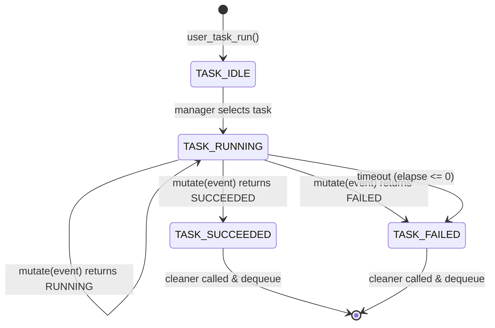

# Task Manager

## Analysis
The `user_task_manager` is a central component of the firmware architecture, providing an asynchronous execution environment based on a cooperative multi-tasking model.

### Core Logic
- **Task Queue**: Managed via `task_queue_t`, storing `user_task_handle_t` objects.
- **Asynchronous Execution**: The manager does not use a traditional RTOS. Instead, it relies on an event-driven mechanism.
- **Event Subscription**: It subscribes to all system events using `user_event_subscribe(USER_EVENT_ANY, ...)`. Every time an event occurs, the task manager runs an iteration.
- **State Machine**: Each task has a `mutate` function (a handler). This function is called with the current event and context, and it returns the next state of the task.
- **Persistence**: The task queue and current task pointer are stored in **retention memory** (`__SECTION_ZERO("retention_mem_area0")`), ensuring that the execution state is preserved even after the SoC enters deep sleep and wakes up.

### Task Lifecycle
1. **Idle**: Task is in the queue waiting for its turn.
2. **Running**: Task is currently being processed.
3. **Succeeded / Failed**: Terminal states that lead to task removal from the queue.
4. **Timeout**: If `elapse` reaches zero, the task is forcefully terminated.

### Diagrams
## Task Manager State Machine

## Findings
- **Efficient Sleep Management**: By using retention memory and an event-driven approach, the system can stay in sleep mode most of the time, waking up only to process specific events.
- **Strictly Sequential**: The current implementation processes one task at a time (FIFO queue), simplifying concurrency management.
- **Safety**: Task timeouts prevent a single hanging task from blocking the entire system.

## Dependencies
- [[field-devices__middleware__ble-utils|uses]]

## Next Steps
Analyze how BLE events specifically trigger these task mutations in [[field-devices__middleware__ble-utils|BLE Utils]].
