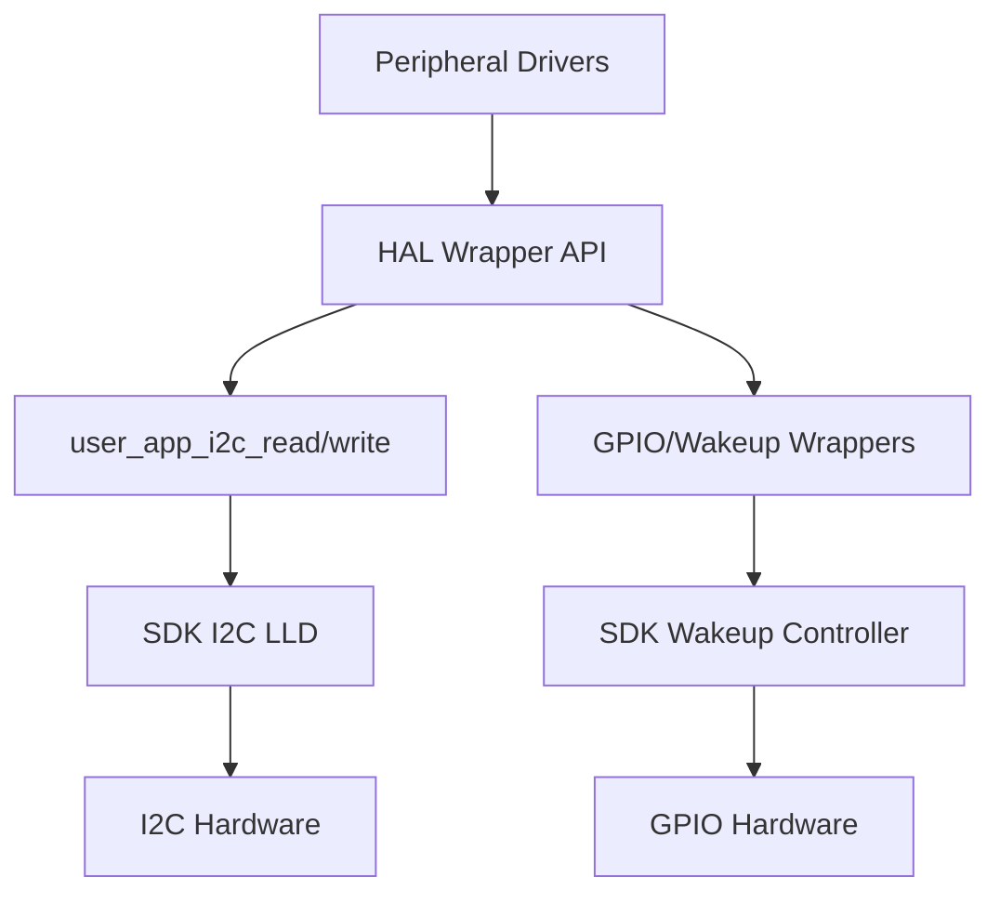

# HAL Integration

## Analysis
The Hardware Abstraction Layer (HAL) in this project serves as a bridge between the vendor SDK (Dialog SmartBond) and the high-level application/middleware logic.

### I2C Wrapper Layer
The core of the HAL integration is the synchronous I2C wrapper:
- **`user_app_i2c_read` / `user_app_i2c_write`**: These functions provide a simplified interface for peripheral drivers.
- **Dynamic Configuration**: The `set_i2c_config(device)` function is called before every I2C transaction. This allows the system to communicate with multiple I2C slaves with different addresses and requirements using a single I2C master peripheral.
- **SDK Calls**: The wrappers eventually call `i2c_master_transmit_buffer_sync` and `i2c_master_receive_buffer_sync` from the Dialog SDK.

### GPIO and Interrupts
- **`wkupct` Integration**: The Dialog SDK's Wake-up Controller (`wkupct`) is used to handle external interrupts.
- **`user_app_wakeup_init`**: Sets up GPIOs (like `INT3_PIN` for LSM6DSOX) to trigger system wake-up from sleep.
- **Mapping**: Peripheral pins are defined in `user_periph_setup.h`.

### Diagrams
## HAL Layer Architecture

## Findings
- **Synchronous Design**: The current HAL wrappers are synchronous (blocking). This is acceptable given the task manager's cooperative nature but requires careful consideration of transaction lengths.
- **Centralized Configuration**: `set_i2c_config` is a clever way to handle I2C bus sharing without complex locking mechanisms (since execution is mostly single-threaded).
- **Power Efficiency**: Tight integration with the SDK's wake-up controller is essential for the device's low-power targets.

## Dependencies
- [[field-devices__app__wearable-device|implements]]
- [[field-devices__app__smartband|implements]]

## Next Steps
Analyze specific application implementations in Layer 4 ([[field-devices__app__wearable-device|Wearable Device]], [[field-devices__app__smartband|Smartband]]).
