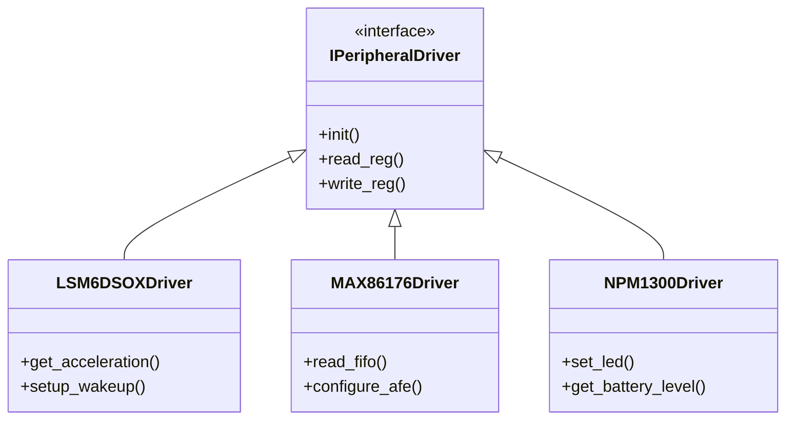

# Peripheral Drivers

## Analysis
The `field-devices` firmware includes drivers for several high-performance sensors and power management ICs. These drivers are typically integrated directly within the application source tree (`apps/{app}/src/drivers/`) to allow for app-specific configurations.

### Key Drivers
- **LSM6DSOX (STMicroelectronics)**: 
    - **Function**: 6-axis IMU (Accelerometer + Gyroscope).
    - **Protocol**: I2C.
    - **Features**: Supports wake-up interrupts (`USER_LSM6DSOX_EVENT_WAKEUP`) and FIFO management.
- **MAX86176 (Analog Devices/Maxim)**: 
    - **Function**: Integrated Photoplethysmogram (PPG) and Electrocardiogram (ECG) analog front-end.
    - **Protocol**: I2C.
    - **Usage**: Primary sensor for health-related data acquisition.
- **nPM1300 (Nordic Semiconductor)**:
    - **Function**: Power Management IC (PMIC).
    - **Protocol**: I2C.
    - **Usage**: Controls battery charging, system power rails, and status LEDs.
- **IS31FL3193 (Lumissil)**:
    - **Function**: 3-channel LED driver.
    - **Protocol**: I2C.

### Integration with Task Manager
Drivers often dispatch events to the global event system, which in turn triggers task mutations in the [[field-devices__middleware__task-manager|Task Manager]]. For example, a "motion detected" interrupt from the LSM6DSOX triggers an event that can wake up a data logging task.

### Diagrams
## Driver Hierarchy

## Findings
- **Modular Interface**: Drivers use a function pointer based interface (`read_reg`, `write_reg`) which makes them portable and easy to test.
- **Event-Driven**: Extensive use of hardware interrupts (via `wkupct`) to minimize CPU active time.
- **Diversity**: The project successfully integrates components from various vendors (ST, Maxim, Nordic, Lumissil) into a cohesive system.

## Dependencies
- [[field-devices__driver__hal-integration|uses]]
- [[field-devices__middleware__task-manager|uses]]

## Next Steps
Analyze the HAL integration ([[field-devices__driver__hal-integration|HAL Integration]]) to see how the I2C bus is shared among these diverse peripherals.
