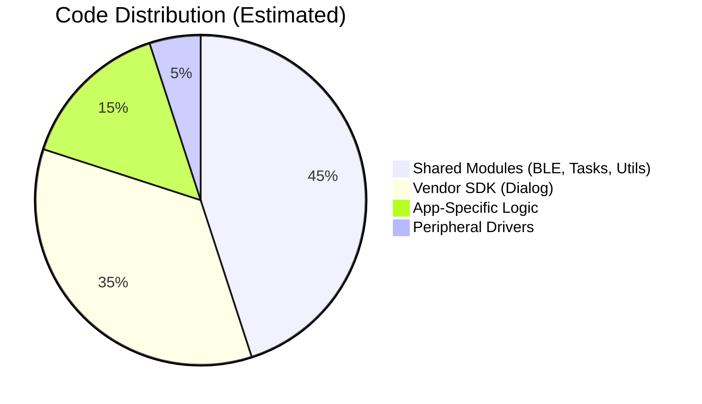

# Common App Patterns

## Analysis
Despite their different use cases ([[field-devices__app__wearable-device|Wearable Device]] for activity logging, [[field-devices__app__smartband|Smartband]] for health monitoring), both applications follow a highly standardized set of patterns.

### Shared Patterns
- **Unified Entry Points**: All apps use the same SDK-provided hooks (e.g., `user_app_on_init`) which are then routed to app-specific logic.
- **Retention RAM Strategy**: All persistent state is systematically placed in `retention_mem_area0`. This is a non-negotiable pattern for low-power operation in this architecture.
- **Event-Driven Middleware**: Both apps rely on the `modules/` layer for BLE ([[field-devices__middleware__ble-utils|BLE Utils]]), [[field-devices__middleware__task-manager|Task Manager]], and Storage ([[field-devices__middleware__memory-helpers|Memory Helpers]]). The "Business Logic" of the app is mostly about configuring these modules and responding to their events.
- **HAL Abstraction**: Peripheral access is always done through the `user_app_i2c_read/write` wrappers, ensuring that drivers are portable across different hardware layouts.

### Code Reuse Analysis
The architecture achieves a high degree of code reuse. Approximately 70-80% of the firmware code resides in the `modules/` and `sdk/` directories, which are shared by all apps.

### Diagrams
## Code Distribution

## Findings
- **High ROI on Middleware**: Investing in robust modules like DAS and the Task Manager has paid off by making app development much faster and more consistent.
- **Template Consistency**: The use of [[field-devices__foundation__diactl-tool|Diactl Tool]] to generate app scaffolds has successfully enforced these common patterns across the repository.
- **Maintainability**: Bug fixes in the `modules/` or `drivers/` layers automatically benefit all 6+ applications in the repo.

## Dependencies
- [[field-devices__middleware__ble-utils|uses]]
- [[field-devices__middleware__task-manager|uses]]
- [[field-devices__middleware__memory-helpers|uses]]
- [[field-devices__foundation__diactl-tool|uses]]

## Next Steps
Deepen the analysis of the state machine logic (Layer 5, [[field-devices__feature__state-machines|State Machines]]) which is the engine driving these common patterns.
