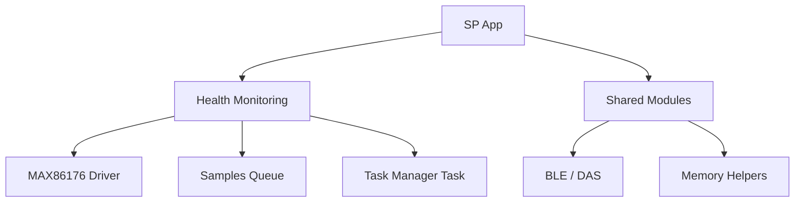

# App SP

## Analysis
The Smartband (SP) application is a specialized variant focused on high-fidelity health data acquisition, specifically PPG and ECG signals.

### Unique Features
- **Health Sensor Integration**: Heavily utilizes the MAX86176 AFE. Unlike the WD app, the SP app must handle high-frequency data streams from this sensor.
- **Data Buffering**: Implements a dedicated `samples_queue_t` to buffer `user_max86176_sample_t` (Red, IR, and ECG data). This is necessary because the BLE transmission rate might be lower than the sampling rate.
- **Task-Based Architecture**: Makes explicit use of the [[field-devices__middleware__task-manager|Task Manager]] to handle the sensor polling and data processing loop as a background task.

### Comparison with WD App
- **WD**: Focuses on event-driven activity tracking and various logging "packages".
- **SP**: Focuses on continuous stream-like data acquisition from a specific high-end health sensor.
- **Shared**: Both apps share the same underlying HAL, SDK, and BLE (DAS) infrastructure, demonstrating the power of the monorepo structure.

### Diagrams
## SP Component Tree

## Findings
- **Specialization**: The SP app demonstrates how the core architecture can be adapted for high-throughput sensor data without redesigning the communication or power management layers.
- **Resource Management**: High-frequency sampling requires careful management of RAM (for buffers) and CPU (for processing), making the use of the Task Manager even more critical here than in WD.

## Dependencies
- [[field-devices__middleware__task-manager|uses]]
- [[field-devices__middleware__ble-utils|uses]]
- [[field-devices__middleware__memory-helpers|uses]]
- [[field-devices__app__common-patterns|implements]]

## Next Steps
Identify the commonalities between these two applications in [[field-devices__app__common-patterns|Common App Patterns]] to evaluate the overall architecture's reuse efficiency.
