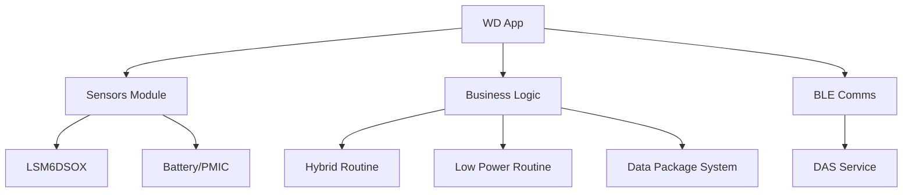
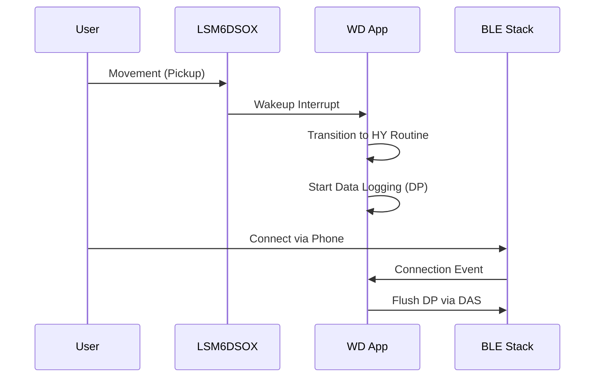

# App Reference WD

## Analysis
The Wearable Device (WD) application serves as the reference implementation for a complex, multi-sensor field device in this monorepo.

### Application Logic
- **Data Packages (DP)**: The WD app manages several logical data streams:
    - `DP_SYSTEM_DATA`: Device health and status.
    - `DP_USER_DATA`: User-specific interactions.
    - `DP_LOCATION_DATA`: Proximity and location tracking.
    - `DP_SANITIZATION_DATA`: Specific use-case data (e.g., hand hygiene).
    - `DP_CONTACT_DATA`: Contact tracing or peer-to-peer interaction logs.
- **Routines**: It implements `user_hy_routine` (Hybrid) and `user_lo_routine` (Low-power), which define how the device behaves in different activity states.
- **Sensor Integration**: Integrates the LSM6DSOX IMU for activity tracking and an nPM1300 for power/LED management.

### Data Flow
1. **Acquisition**: Sensors (IMU, Battery) are polled or trigger interrupts.
2. **Processing**: Data is formatted into the relevant Data Package (DP).
3. **Storage**: DPs are temporarily stored in retention RAM or moved to external Flash via [[field-devices__middleware__memory-helpers|Memory Helpers]].
4. **Transmission**: When a BLE connection is established, the DAS service ([[field-devices__middleware__ble-utils|BLE Utils]]) transmits the accumulated DPs to the peer.

### Diagrams
## WD Component Tree

## User Interaction Flow

## Findings
- **High Complexity**: The WD app is the most feature-rich, utilizing almost all available modules.
- **Persistence**: Systematic use of retention memory ensures that no data is lost during the frequent sleep/wake cycles required for long battery life.
- **Modularity**: The use of independent Data Packages allows for granular data management and transmission.

## Dependencies
- [[field-devices__middleware__ble-utils|uses]]
- [[field-devices__middleware__memory-helpers|uses]]
- [[field-devices__app__smartband|consumes]]

## Next Steps
Compare this reference implementation with the specialized Smartband (SP) application in [[field-devices__app__smartband|Smartband]].
