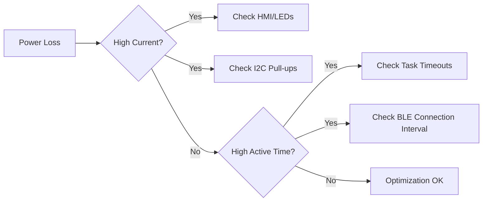

# Power Management

## Analysis
Power management is a critical aspect of the `field-devices` architecture, designed to achieve months of battery life on small LiPo or coin cell batteries.

### Sleep Strategies
- **Extended Sleep**: The default low-power mode for the DA145xx SoCs. It keeps the System RAM powered (retention) while shutting down the CPU and most peripherals. This allows the state machine and task queue to persist.
- **Wake-up Controller (`wkupct`)**: Configured to wake the SoC from sleep based on external triggers like motion (LSM6DSOX interrupt) or button presses.
- **Event-Driven Execution**: The CPU is active only when there's an event to process. After the event handler completes, the system immediately checks if it can return to sleep.

### PMIC Integration (nPM1300)
- **Dynamic Voltage Scaling**: The nPM1300 can adjust rail voltages to match the current power profile.
- **Battery Management**: Includes high-accuracy fuel gauging and controlled charging.
- **LED Control**: Offloading LED PWM/driving to the nPM1300 or IS31FL3193 reduces the burden on the main SoC.

### Optimization Patterns
- **Synchronous I2C**: While blocking, synchronous I2C with a high clock rate (400kHz+) ensures the CPU spends as little time as possible in "active-waiting" before going back to sleep.
- **Data Batching**: Sensors like the LSM6DSOX use FIFOs to batch data, waking the CPU only once every dozens of samples.

### Diagrams
## Power Bottleneck Identification

## Findings
- **State Persistence is Key**: The decision to use retention RAM is the single most important factor for the architecture's power efficiency.
- **Peripheral Offloading**: Using dedicated chips for HMI (LEDs) and Power (PMIC) is a professional design choice that significantly improves overall system efficiency.

## Dependencies
- [[field-devices__integration__patterns|uses]]

## Next Steps
Synthesize the overall integration patterns in Layer 6 ([[field-devices__integration__patterns|Integration Patterns]]).
