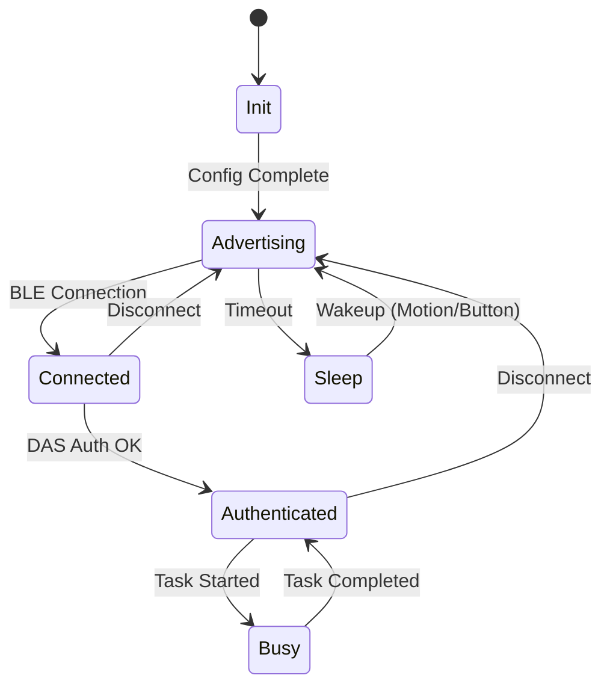

# State Machines

## Analysis
The behavior of `field-devices` is governed by a hierarchical state machine approach, combining global application states with granular task-specific states.

### Global Application States
Managed primarily via the `app_mode_t` variable and SDK event hooks:
- **`POWER_ON / INIT`**: Initial hardware and stack setup.
- **`ADVERTISING`**: Device is broadcasting its presence. Triggered after successful configuration.
- **`CONNECTED`**: A BLE connection is established.
- **`AUTHENTICATED`**: The peer has successfully completed the DAS authentication challenge.
- **`BUSY / LOGGING`**: Active data acquisition is in progress (e.g., during a Hybrid routine).
- **`SLEEP`**: Low-power state with RAM retention.

### Task-Specific State Machines
Managed by the [[field-devices__middleware__task-manager|Task Manager]]:
- Each background operation (e.g., reading a large sensor FIFO, performing an OTA update) is implemented as an independent state machine.
- These tasks evolve based on both timer events and hardware interrupts.

### Diagrams
## Device Operation States

## Findings
- **Separation of Concerns**: Global states handle the lifecycle of the device and its connectivity, while the task manager handles the complexity of asynchronous hardware interactions.
- **Security-First**: Access to sensitive operations (like data offloading) is gated by the "Authenticated" state, enforced via the DAS module.
- **Resilience**: Using the task manager for complex operations ensures that a failure in one task (e.g., a sensor read error) doesn't necessarily crash the entire application state.

## Dependencies
- [[field-devices__middleware__task-manager|uses]]
- [[field-devices__feature__power-management|validates]]

## Next Steps
Analyze how these states are optimized for power consumption in [[field-devices__feature__power-management|Power Management]].
