# Final Summary

## Architectural Audit
The `field-devices` repository represents a mature and well-engineered monorepo for Dialog/Renesas SmartBond™ based IoT devices. The architecture successfully balances the extreme memory and power constraints of the DA145xx family with the need for modularity and code reuse across multiple product lines.

### Core Strengths
- **Modular Middleware**: Modules like the [[field-devices__middleware__task-manager|Task Manager]] and [[field-devices__middleware__ble-utils|BLE Utils]] provide a high-level abstraction that hides the complexity of asynchronous BLE programming.
- **Power Efficiency**: The architecture is "sleep-first," with systematic use of retention RAM and hardware interrupts to maximize battery life.
- **Tooling**: The [[field-devices__foundation__diactl-tool|Diactl Tool]] significantly reduces the barrier to entry for creating new firmware variants and maintains repository standards.
- **Unified HAL**: A consistent peripheral abstraction layer allows for driver portability and simplifies hardware bring-up.

### Criticial Findings and Risks
- **Vendor Lock-in**: The middleware is tightly integrated with Dialog's proprietary architectural patterns (e.g., the `ke_msg` system), making it difficult to port to other SoC vendors (like Nordic or Silicon Labs).
- **Synchronous Bottlenecks**: High-frequency data acquisition (as seen in the [[field-devices__app__smartband|Smartband]]) might be limited by the synchronous nature of the current I2C/SPI wrappers.
- **Driver Localization**: Currently, many drivers are located within the `apps/` tree. This could lead to code duplication as the number of apps grows.

### Final Recommendations
1. **Global Driver Library**: Refactor peripheral drivers (LSM6DSOX, MAX86176, etc.) into a centralized, versioned library in the `drivers/` directory.
2. **Asynchronous HAL**: Introduce an asynchronous version of the I2C/SPI wrappers using DMA and interrupts to improve performance for high-throughput sensors.
3. **Automated Testing**: Leverage the modular design to implement unit tests for the business logic in `modules/` using a mock HAL/SDK.

### Diagrams
## Analysis Execution Timeline

```mermaid
gantt
    title Analysis Execution Timeline
    dateFormat  HH:mm
    axisFormat %H:%M

    section Layer 0: Foundation
    Bootstrap (001)           :a1, 10:00, 5m
    Structure (002)           :a2, 10:05, 5m
    section Layer 1: Infrastructure
    SDK Analysis (003)        :b1, 10:10, 5m
    Build System (004)        :b2, 10:15, 5m
    Diactl Tool (005)         :b3, 10:20, 5m
    section Layer 2: Middleware
    Task Manager (006)        :c1, 10:30, 5m
    BLE Utils (007)           :c2, 10:35, 5m
    Memory Helpers (008)      :c3, 10:40, 5m
    section Layer 3: Hardware
    Peripheral Drivers (009)  :d1, 10:45, 5m
    HAL Integration (010)     :d2, 10:50, 5m
    section Layer 4: Applications
    App Reference WD (011)    :e1, 11:00, 5m
    App SP (012)              :e2, 11:05, 5m
    Common Patterns (013)     :e3, 11:10, 5m
    section Layer 5: Logic
    State Machines (014)      :f1, 11:15, 5m
    Power Management (015)    :f2, 11:20, 5m
    section Layer 6: Conclusion
    Integration Patterns (016):g1, 11:25, 5m
    Final Summary (017)       :g2, 11:30, 5m
```

## Conclusion
The `field-devices` codebase is a robust foundation for scalable IoT development. By following the recommended refactoring steps, the project can further improve its long-term maintainability and performance.

## Dependencies
- [[field-devices__overview__bootstrap|uses]]
- [[field-devices__overview__structure|uses]]
- [[field-devices__foundation__sdk-analysis|uses]]
- [[field-devices__foundation__build-system|uses]]
- [[field-devices__foundation__diactl-tool|uses]]
- [[field-devices__middleware__task-manager|uses]]
- [[field-devices__middleware__ble-utils|uses]]
- [[field-devices__middleware__memory-helpers|uses]]
- [[field-devices__driver__peripheral-drivers|uses]]
- [[field-devices__driver__hal-integration|uses]]
- [[field-devices__app__wearable-device|uses]]
- [[field-devices__app__smartband|uses]]
- [[field-devices__app__common-patterns|uses]]
- [[field-devices__feature__state-machines|uses]]
- [[field-devices__feature__power-management|uses]]
- [[field-devices__integration__patterns|uses]]
