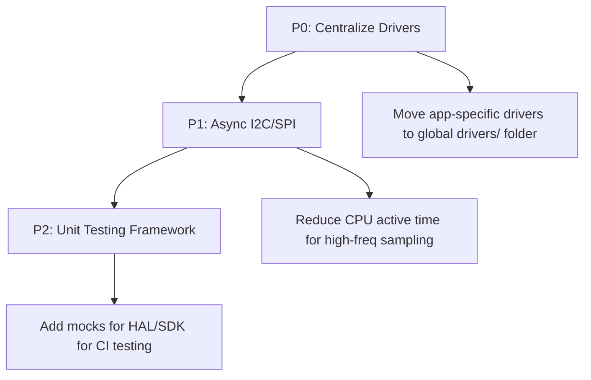

# Integration Patterns

## Analysis
The integration of various software components (SDK, Modules, Drivers) into a functional firmware image is achieved through a combination of static configuration structures and conditional compilation.

### Static Configuration Pattern
Following the Dialog SDK's architectural requirements, the project uses large static structures defined in `user_config.h` to configure the system:
- **`user_adv_conf`**: Advertising parameters (intervals, channels, mode).
- **`user_gapm_conf`**: GAP Manager configuration (MTU size, device roles, address type).
- **`user_security_conf`**: Security requirements (IO capabilities, authentication levels).

### Conditional Compilation and Hardware Variants
- **`#ifdef USER_CFG_TASK`**: Enables or disables the Task Manager module.
- **`#if USER_MEMORY_TYPE == ...`**: Selects between Flash and EEPROM at compile-time.
- **`-include` Flags**: As identified in [[field-devices__foundation__build-system|Build System]], the build system forces the inclusion of configuration headers. This allows the same source file to behave differently depending on which application it is being compiled for, without using messy relative paths in the code.

### Repository-Level Integration
The [[field-devices__foundation__diactl-tool|Diactl Tool]] ensures that every new application follows the same integration pattern by generating a standardized set of configuration files and project structures.

### Diagrams
## Improvement Roadmap

## Findings
- **Standardization**: The project has a very high level of consistency, making it easy for a developer to switch between different applications.
- **Configuration Overhead**: While robust, the large number of configuration macros and structs can be daunting for new developers.
- **Build-Time Binding**: Most integration happens at compile-time, which is optimal for memory-constrained embedded systems but requires a full recompile for any minor config change.

## Dependencies
- [[field-devices__foundation__build-system|uses]]
- [[field-devices__foundation__diactl-tool|uses]]
- [[field-devices__integration__final-summary|validates]]

## Next Steps
Proceed to the [[field-devices__integration__final-summary|Final Summary]] to conclude the analysis.
