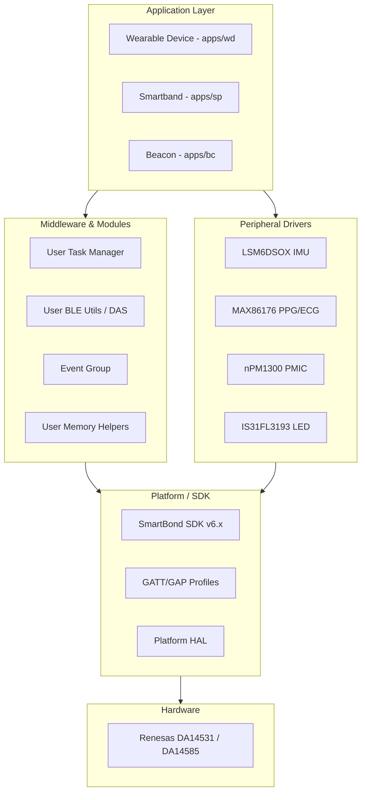

# Architecture Overview

## Component Diagram

```mermaid
graph TD
    subgraph Application_Layer [Application Layer]
        WD[Wearable Device - apps/wd]
        SP[Smartband - apps/sp]
        BC[Beacon - apps/bc]
    end
    
    subgraph Middleware_Layer [Middleware & Modules]
        TM[User Task Manager]
        BLE_U[User BLE Utils / DAS]
        EVT[Event Group]
        MEM[User Memory Helpers]
    end
    
    subgraph Driver_Layer [Peripheral Drivers]
        IMU[LSM6DSOX IMU]
        PPG[MAX86176 PPG/ECG]
        PMIC[nPM1300 PMIC]
        LED[IS31FL3193 LED]
    end
    
    subgraph SDK_Layer [Platform / SDK]
        SDK[SmartBond SDK v6.x]
        GATT[GATT/GAP Profiles]
        HAL[Platform HAL]
    end
    
    subgraph Hardware_Layer [Hardware]
        SoC[Renesas DA14531 / DA14585]
    end
    
    Application_Layer --> Middleware_Layer
    Application_Layer --> Driver_Layer
    Middleware_Layer --> SDK_Layer
    Driver_Layer --> SDK_Layer
    SDK_Layer --> Hardware_Layer
```
