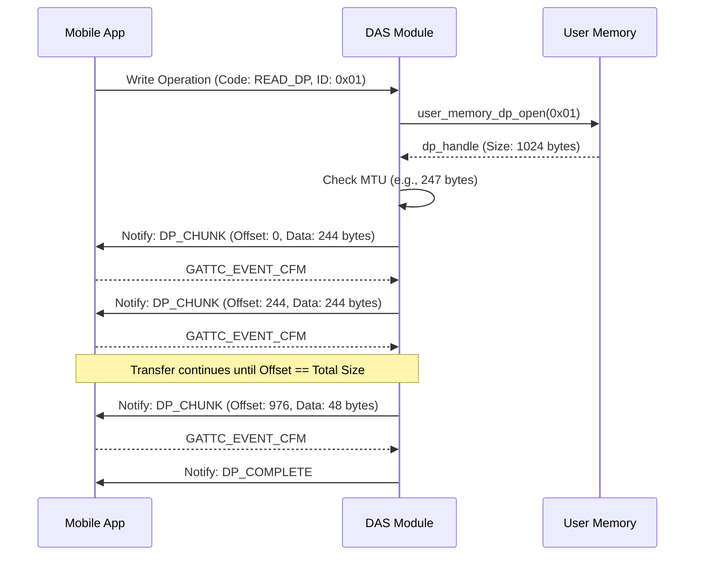

# BLE Data Acquisition Service (DAS) Protocol

```mermaid
sequenceDiagram
    participant App as Mobile App
    participant DAS as DAS Module
    participant MEM as User Memory

    App->>DAS: Write Operation (Code: READ_DP, ID: 0x01)
    DAS->>MEM: user_memory_dp_open(0x01)
    MEM-->>DAS: dp_handle (Size: 1024 bytes)
    DAS->>DAS: Check MTU (e.g., 247 bytes)
    
    DAS->>App: Notify: DP_CHUNK (Offset: 0, Data: 244 bytes)
    App-->>DAS: GATTC_EVENT_CFM
    
    DAS->>App: Notify: DP_CHUNK (Offset: 244, Data: 244 bytes)
    App-->>DAS: GATTC_EVENT_CFM
    
    Note over App,DAS: Transfer continues until Offset == Total Size
    
    DAS->>App: Notify: DP_CHUNK (Offset: 976, Data: 48 bytes)
    App-->>DAS: GATTC_EVENT_CFM
    
    DAS->>App: Notify: DP_COMPLETE
```
