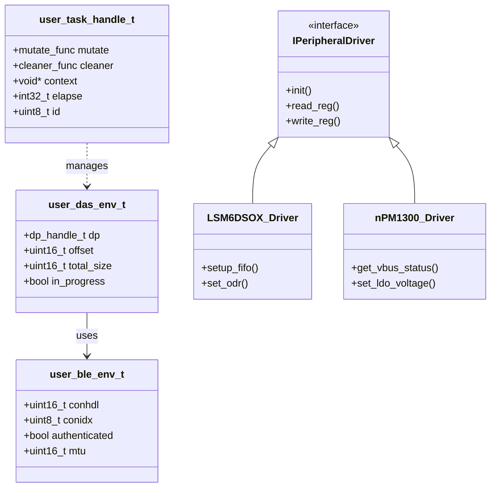

# Key Structs and Types Hierarchy

```mermaid
classDiagram
    class user_task_handle_t {
        +mutate_func mutate
        +cleaner_func cleaner
        +void* context
        +int32_t elapse
        +uint8_t id
    }
    
    class user_ble_env_t {
        +uint16_t conhdl
        +uint8_t conidx
        +bool authenticated
        +uint16_t mtu
    }
    
    class user_das_env_t {
        +dp_handle_t dp
        +uint16_t offset
        +uint16_t total_size
        +bool in_progress
    }
    
    class IPeripheralDriver {
        <<interface>>
        +init()
        +read_reg()
        +write_reg()
    }
    
    class LSM6DSOX_Driver {
        +setup_fifo()
        +set_odr()
    }
    
    class nPM1300_Driver {
        +get_vbus_status()
        +set_ldo_voltage()
    }
    
    user_task_handle_t ..> user_das_env_t : manages
    user_das_env_t --> user_ble_env_t : uses
    IPeripheralDriver <|-- LSM6DSOX_Driver
    IPeripheralDriver <|-- nPM1300_Driver
```
