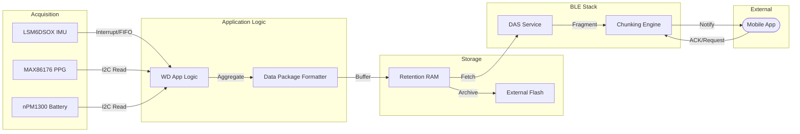

# Data Flow Diagram

```mermaid
flowchart LR
    subgraph Acquisition
        IMU[LSM6DSOX IMU]
        PPG[MAX86176 PPG]
        BATT[nPM1300 Battery]
    end
    
    subgraph Processing [Application Logic]
        WD[WD App Logic]
        DP[Data Package Formatter]
    end
    
    subgraph Storage
        RAM[Retention RAM]
        FLASH[External Flash]
    end
    
    subgraph Transmission [BLE Stack]
        DAS[DAS Service]
        CHUNK[Chunking Engine]
    end
    
    subgraph External
        APP([Mobile App])
    end
    
    IMU -->|Interrupt/FIFO| WD
    PPG -->|I2C Read| WD
    BATT -->|I2C Read| WD
    
    WD -->|Aggregate| DP
    DP -->|Buffer| RAM
    RAM -->|Archive| FLASH
    
    RAM -->|Fetch| DAS
    DAS -->|Fragment| CHUNK
    CHUNK -->|Notify| APP
    APP -->|ACK/Request| CHUNK
```
