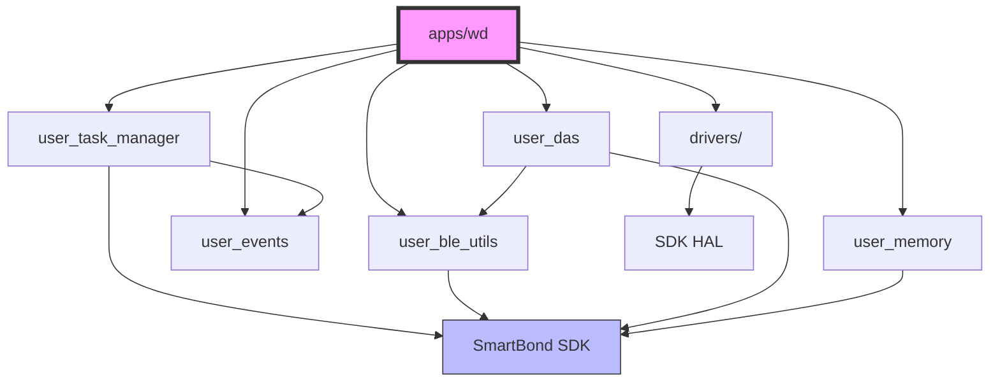

# Module Dependency Graph

```mermaid
graph TD
    WD[apps/wd] --> TM[user_task_manager]
    WD --> BLE[user_ble_utils]
    WD --> DAS[user_das]
    WD --> EVT[user_events]
    WD --> MEM[user_memory]
    WD --> DRV[drivers/]
    
    DRV --> HAL[SDK HAL]
    
    TM --> EVT
    TM --> SDK[SmartBond SDK]
    
    BLE --> SDK
    DAS --> BLE
    DAS --> SDK
    
    MEM --> SDK
    
    style WD fill:#f9f,stroke:#333,stroke-width:4px
    style SDK fill:#bbf,stroke:#333
```
