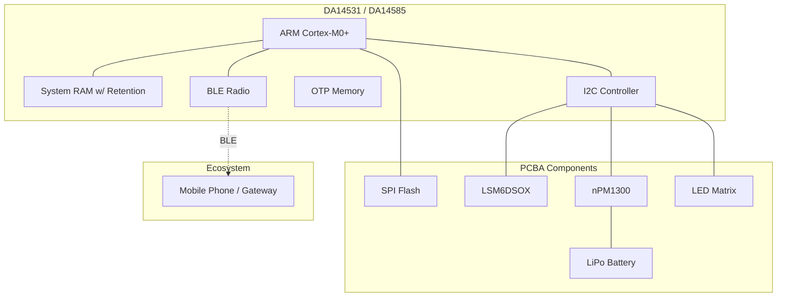

# Hardware Architecture / Deployment

```mermaid
graph TD
    subgraph SoC [DA14531 / DA14585]
        CPU[ARM Cortex-M0+]
        RAM[System RAM w/ Retention]
        RADIO[BLE Radio]
        OTP[OTP Memory]
        I2C[I2C Controller]
    end
    
    subgraph External_Components [PCBA Components]
        FLASH[SPI Flash]
        IMU[LSM6DSOX]
        PMIC[nPM1300]
        LED[LED Matrix]
        BATT[LiPo Battery]
    end
    
    subgraph Ecosystem
        Phone[Mobile Phone / Gateway]
    end
    
    CPU --- RAM
    CPU --- I2C
    CPU --- RADIO
    
    I2C --- IMU
    I2C --- PMIC
    I2C --- LED
    
    CPU --- FLASH
    PMIC --- BATT
    
    RADIO -.->|BLE| Phone
```
