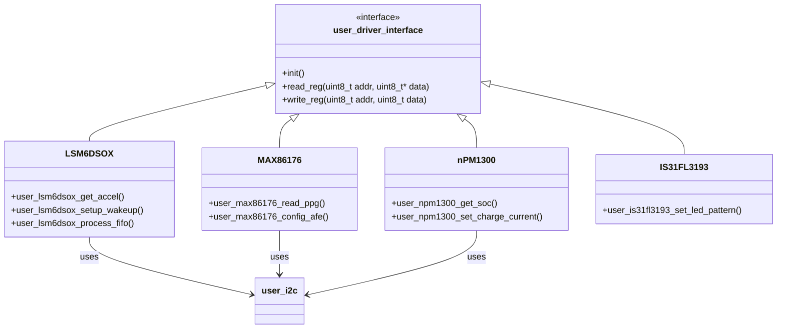

# Sensor and Peripheral Driver Hierarchy

```mermaid
classDiagram
    class user_driver_interface {
        <<interface>>
        +init()
        +read_reg(uint8_t addr, uint8_t* data)
        +write_reg(uint8_t addr, uint8_t data)
    }

    class LSM6DSOX {
        +user_lsm6dsox_get_accel()
        +user_lsm6dsox_setup_wakeup()
        +user_lsm6dsox_process_fifo()
    }

    class MAX86176 {
        +user_max86176_read_ppg()
        +user_max86176_config_afe()
    }

    class nPM1300 {
        +user_npm1300_get_soc()
        +user_npm1300_set_charge_current()
    }

    class IS31FL3193 {
        +user_is31fl3193_set_led_pattern()
    }

    user_driver_interface <|-- LSM6DSOX
    user_driver_interface <|-- MAX86176
    user_driver_interface <|-- nPM1300
    user_driver_interface <|-- IS31FL3193

    LSM6DSOX --> user_i2c : uses
    MAX86176 --> user_i2c : uses
    nPM1300 --> user_i2c : uses
```
