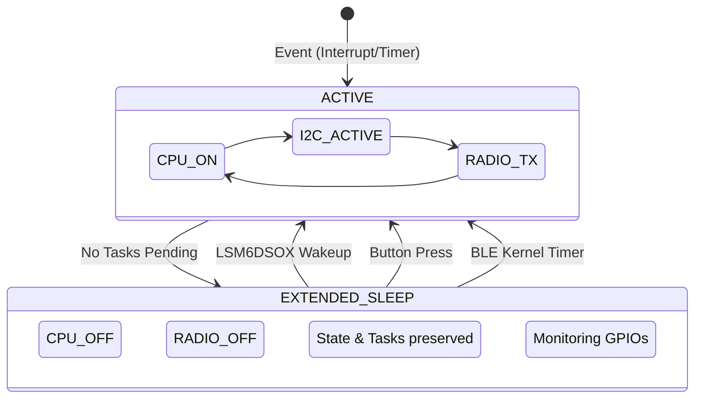

# Power Management State Diagram

```mermaid
stateDiagram-v2
    [*] --> ACTIVE: Event (Interrupt/Timer)
    ACTIVE --> EXTENDED_SLEEP: No Tasks Pending
    
    state ACTIVE {
        direction LR
        CPU_ON --> I2C_ACTIVE
        I2C_ACTIVE --> RADIO_TX
        RADIO_TX --> CPU_ON
    }
    
    state EXTENDED_SLEEP {
        CPU_OFF
        RADIO_OFF
        SYSRAM_RETENTION: State & Tasks preserved
        WKUPCT_ACTIVE: Monitoring GPIOs
    }
    
    EXTENDED_SLEEP --> ACTIVE: LSM6DSOX Wakeup
    EXTENDED_SLEEP --> ACTIVE: Button Press
    EXTENDED_SLEEP --> ACTIVE: BLE Kernel Timer
```
