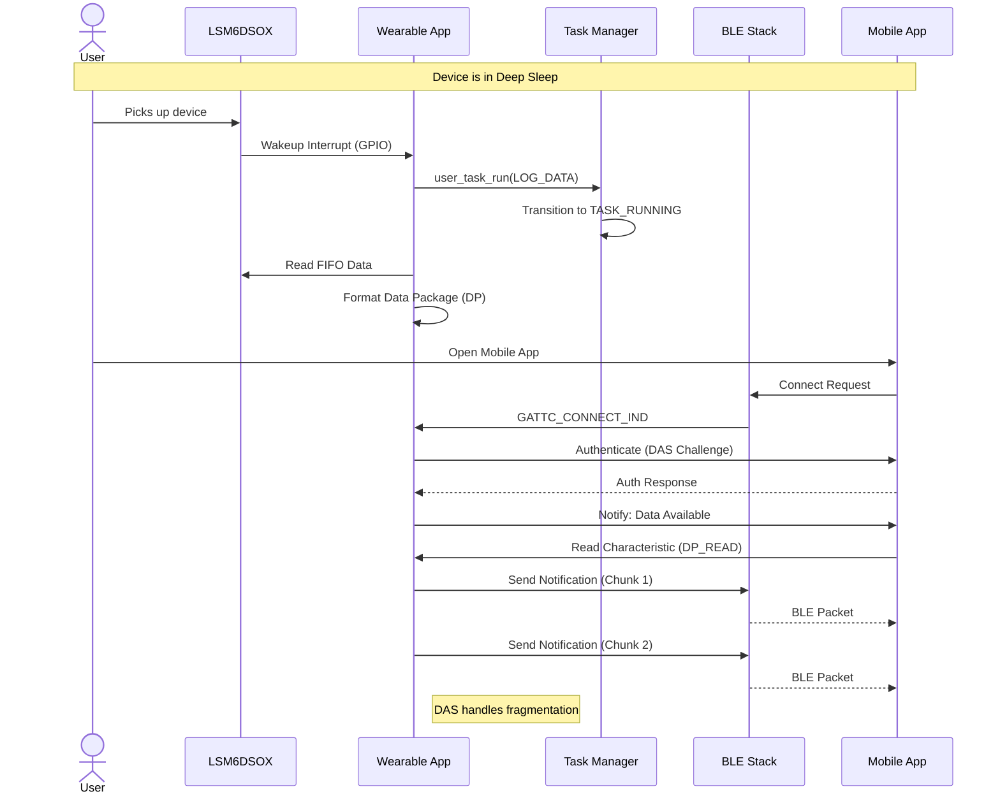

# Main Operation Sequence

```mermaid
sequenceDiagram
    actor User
    participant IMU as LSM6DSOX
    participant WD as Wearable App
    participant TM as Task Manager
    participant BLE as BLE Stack
    participant Peer as Mobile App
    
    Note over User,Peer: Device is in Deep Sleep
    User->>IMU: Picks up device
    IMU->>WD: Wakeup Interrupt (GPIO)
    WD->>TM: user_task_run(LOG_DATA)
    TM->>TM: Transition to TASK_RUNNING
    WD->>IMU: Read FIFO Data
    WD->>WD: Format Data Package (DP)
    
    User->>Peer: Open Mobile App
    Peer->>BLE: Connect Request
    BLE->>WD: GATTC_CONNECT_IND
    WD->>Peer: Authenticate (DAS Challenge)
    Peer-->>WD: Auth Response
    
    WD->>Peer: Notify: Data Available
    Peer->>WD: Read Characteristic (DP_READ)
    WD->>BLE: Send Notification (Chunk 1)
    BLE-->>Peer: BLE Packet
    WD->>BLE: Send Notification (Chunk 2)
    BLE-->>Peer: BLE Packet
    Note right of WD: DAS handles fragmentation
```
