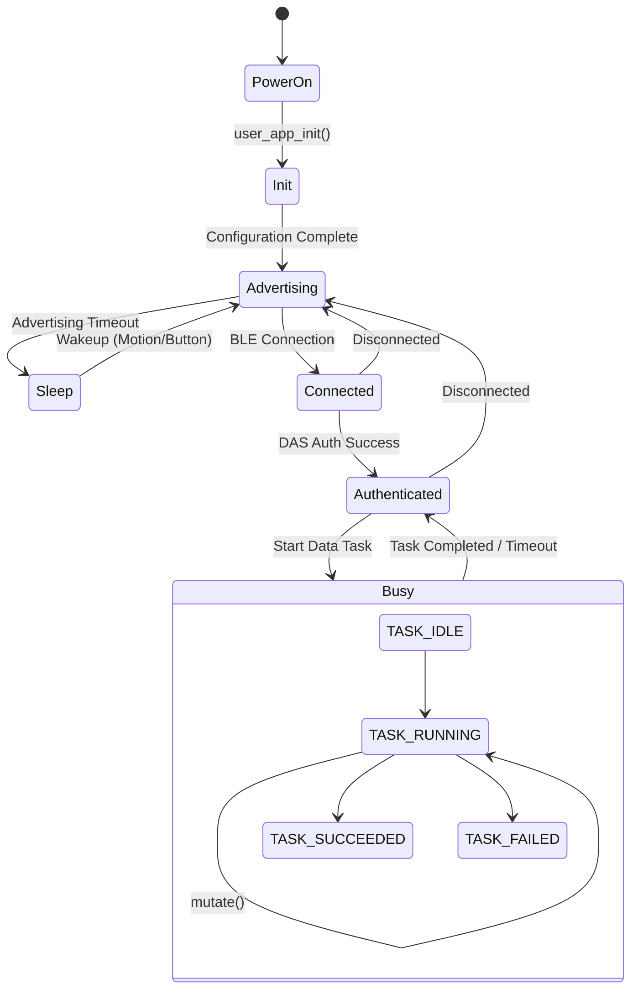

# Device State Machine

```mermaid
stateDiagram-v2
    [*] --> PowerOn
    PowerOn --> Init: user_app_init()
    Init --> Advertising: Configuration Complete
    
    Advertising --> Sleep: Advertising Timeout
    Sleep --> Advertising: Wakeup (Motion/Button)
    
    Advertising --> Connected: BLE Connection
    Connected --> Advertising: Disconnected
    
    Connected --> Authenticated: DAS Auth Success
    Authenticated --> Busy: Start Data Task
    Busy --> Authenticated: Task Completed / Timeout
    
    Authenticated --> Advertising: Disconnected
    
    state Busy {
        TASK_IDLE --> TASK_RUNNING
        TASK_RUNNING --> TASK_RUNNING: mutate()
        TASK_RUNNING --> TASK_SUCCEEDED
        TASK_RUNNING --> TASK_FAILED
    }
```
