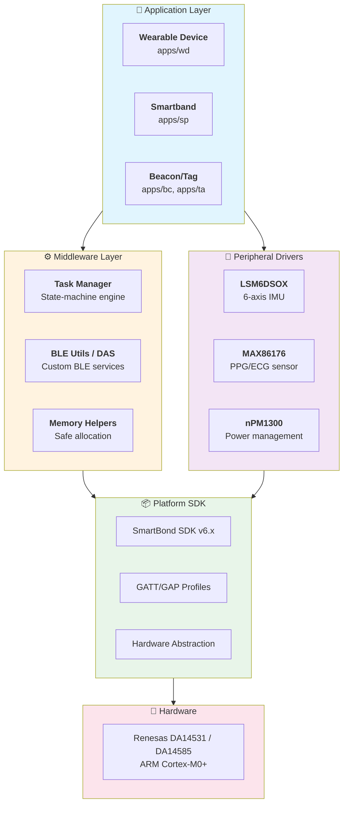

# Field Devices - Technical Specifications

> **Comprehensive architectural documentation for the Field Devices BLE firmware monorepo**

[]()
[]()
[]()
[]()

---

## 📋 Overview

**Field Devices** is a professional-grade **monorepo** for developing Bluetooth Low Energy (BLE) firmware targeting **Renesas/Dialog SmartBond™** SoCs (DA14531, DA14585). The repository provides a complete ecosystem for building IoT wearable devices, smart sensors, and health monitoring solutions.

This specification repository documents the architecture, patterns, and implementation details extracted through automated analysis, providing a navigable knowledge base for developers, architects, and stakeholders.

---

## 🎯 Project Summary

| Attribute | Value |
|-----------|-------|
| **Project Type** | Embedded Firmware Monorepo |
| **Domain** | IoT / Wearables / Health Sensors |
| **Target Hardware** | Renesas DA14531, DA14585 (ARM Cortex-M0/M0+) |
| **Primary Language** | C (Firmware) |
| **Secondary Language** | Python (Tooling) |
| **SDK** | Dialog SmartBond™ SDK v6.x |
| **IDE** | Keil uVision 5 + ARM Compiler 6 |
| **Applications** | Wearable Device (WD), Smartband (SP), Beacon, Tag |

---

## 🏗️ Architecture

The project follows a **layered architecture** designed to maximize code reuse while maintaining hardware abstraction:



### Architecture Highlights

| Layer | Purpose | Key Components |
|-------|---------|----------------|
| **Application** | Device-specific logic | `apps/wd`, `apps/sp`, `apps/bc` |
| **Middleware** | Shared abstractions | `user_task_manager`, `user_ble_utils`, `user_das` |
| **Drivers** | Sensor integration | LSM6DSOX, MAX86176, nPM1300 |
| **SDK/HAL** | Hardware abstraction | SmartBond SDK, CMSIS |
| **Hardware** | Physical SoC | DA14531, DA14585 |

---

## ✨ Key Features

### 🔄 State-Machine Task Manager
A robust asynchronous execution engine that handles complex BLE flows:
- Event-driven architecture
- Priority-based task scheduling  
- Automatic state persistence during sleep

### 📡 Custom BLE Services (DAS)
**Data Acquisition Service** - A proprietary BLE service for reliable data transfer:
- Fragmented packet transmission (overcomes MTU limits)
- Authentication handshake
- Checksum validation

### ⚡ Power-First Design
Optimized for months of battery life:
- Extended sleep with RAM retention
- Hardware interrupt wake-up
- Systematic power state management

### 🛠️ Developer Tooling (diactl)
Python CLI for project management:
```bash
diactl generate app --name my-sensor --template wearable
```

---

## 📂 Specification Structure

This repository is organized following **SPEC-OS** conventions with UID-based file naming:

```
field-devices-spec/
│
├── 📄 README.md                          # This file
├── 📄 00-INDEX.md                        # Navigation hub
│
├── 📁 01-Overview/                       # Project bootstrap & structure
│   ├── field-devices__overview__bootstrap.md
│   ├── field-devices__overview__structure.md
│   └── field-devices__overview__summary.md
│
├── 📁 02-Foundation/                     # SDK, build system, tooling
│   ├── field-devices__foundation__sdk-analysis.md
│   ├── field-devices__foundation__build-system.md
│   └── field-devices__foundation__diactl-tool.md
│
├── 📁 03-Middleware/                     # Core shared modules
│   ├── field-devices__middleware__task-manager.md
│   ├── field-devices__middleware__ble-utils.md
│   └── field-devices__middleware__memory-helpers.md
│
├── 📁 04-Drivers/                        # Hardware drivers
│   ├── field-devices__driver__peripheral-drivers.md
│   └── field-devices__driver__hal-integration.md
│
├── 📁 05-Applications/                   # Device implementations
│   ├── field-devices__app__wearable-device.md
│   ├── field-devices__app__smartband.md
│   └── field-devices__app__common-patterns.md
│
├── 📁 06-Features/                       # Cross-cutting concerns
│   ├── field-devices__feature__state-machines.md
│   └── field-devices__feature__power-management.md
│
├── 📁 07-Integration/                    # Synthesis & audit
│   ├── field-devices__integration__patterns.md
│   └── field-devices__integration__final-summary.md
│
├── 📁 08-Diagrams/                       # Visual documentation
│   ├── field-devices__diagram__index.md
│   ├── field-devices__diagram__architecture-overview.md
│   ├── field-devices__diagram__data-flow.md
│   ├── field-devices__diagram__sequence-main-flow.md
│   ├── field-devices__diagram__state-machine.md
│   ├── field-devices__diagram__ble-protocol.md
│   ├── field-devices__diagram__power-modes.md
│   └── ... (11 diagrams total)
│
└── 📄 _meta.json                         # Structure metadata
```

---

## 🚀 Quick Start

### Navigate the Specs

1. **Start here**: Open [`00-INDEX.md`](00-INDEX.md) for the complete navigation
2. **Architecture overview**: [`01-Overview/field-devices__overview__summary.md`](01-Overview/field-devices__overview__summary.md)
3. **Deep dive into Task Manager**: [`03-Middleware/field-devices__middleware__task-manager.md`](03-Middleware/field-devices__middleware__task-manager.md)
4. **View diagrams**: [`08-Diagrams/field-devices__diagram__index.md`](08-Diagrams/field-devices__diagram__index.md)

### Use with Obsidian

This spec repository is fully compatible with [Obsidian](https://obsidian.md/):

1. Clone this repository
2. Open as an Obsidian vault
3. Enable Graph View to visualize spec relationships
4. Use `[[wiki-links]]` to navigate between specs

---

## 📊 Analysis Statistics

| Metric | Value |
|--------|-------|
| **Analysis ID** | An.1 |
| **Nodes Analyzed** | 17 |
| **Diagrams Generated** | 11 |
| **Total Spec Files** | 30 |
| **Success Rate** | 100% |
| **Engine** | spec-zero-lite v1.1.0 |
| **Generated** | 2026-02-08 |

---

## 🔍 Key Findings

### ✅ Strengths
- **~80% code reuse** across device variants (WD, SP, BC)
- **Robust async engine** - Task Manager handles complex BLE state machines
- **Professional tooling** - `diactl` enforces architectural standards
- **Power optimized** - Sleep-first design with RAM retention

### ⚠️ Considerations
- **Vendor lock-in** to Dialog/Renesas SDK patterns
- **Synchronous I2C/SPI** may bottleneck high-frequency sensors
- **Driver localization** - some drivers live in `apps/` vs centralized `drivers/`

### 💡 Recommendations
1. Centralize all drivers in `drivers/` directory
2. Add async DMA-based peripheral wrappers
3. Implement unit tests with mock HAL

---

## 🔗 Related Resources

| Resource | Link |
|----------|------|
| **Source Repository** | [github.com/handhy-techs/field-devices](https://github.com/handhy-techs/field-devices) |
| **SDK Documentation** | [Renesas SmartBond](https://www.renesas.com/products/wireless-connectivity/bluetooth-low-energy) |
| **Analysis Project** | `HANDHY_ANALYSES/field-devices/An.1/` |

---

## 📜 SPEC-OS Conventions

This repository follows SPEC-OS v1.0 conventions:

- **UID Format**: `{domain}__{type}__{name}` (e.g., `field-devices__middleware__task-manager`)
- **Frontmatter**: YAML metadata in every file
- **Wiki Links**: Obsidian-compatible `[[uid|label]]` format
- **Versioning**: SemVer for spec versions

---

## 📝 License

This specification documentation is auto-generated from source code analysis.  
Source repository: [handhy-techs/field-devices](https://github.com/handhy-techs/field-devices)

---

<div align="center">

**Generated by [spec-zero-lite](https://github.com/MO-HHY/spec-zero-lite) v1.1.0**

*Transforming code into knowledge*

</div>
